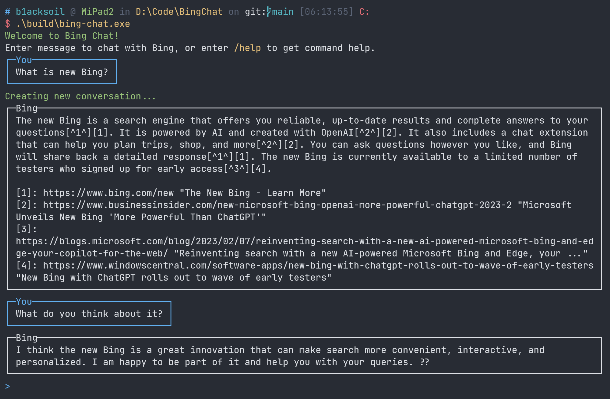

<div align="center">


# BingChat

.NET API wrapper for Microsoft's new AI-powered Bing Chat.


[](https://www.nuget.org/packages/BingChat)
[](./LICENSE)

</div>

> **Warning**
> This library is **unofficial** and heavily depends on reverse-engineering. Use at your own risk.

- [BingChat](#bingchat)
    - [Quick Start](#quick-start)
    - [Interactive Command Line Tool](#interactive-command-line-tool)
    - [Roadmap](#roadmap)
    - [Q\&A](#qa)
    - [Contributors](#contributors)
    - [License](#license)

## Quick Start

> **Note**
> Since BingChat's public release, a valid cookie is no longer required. You can use this package without any
> authentication.

Install this package via NuGet package manager or dotnet CLI:

```
dotnet add package --prerelease BingChat
```

Then,

```csharp
using BingChat;

// Construct the chat client
var client = new BingChatClient(new BingChatClientOptions
{
    // Tone used for conversation
    Tone = BingChatTone.Balanced,
});

var message = "Do you like cats?";
var answer = await client.AskAsync(message);

Console.WriteLine($"Answer: {answer}");
```

The code above sends a message to the chat AI, and gets the answer from it.

This method creates a one-shot conversation and discards it when completed.
If you want to continue chatting in the same context (just like the behavior in the web interface), you need to create a
shared conversation:

```csharp
// Create a conversation, so we can continue chatting in the same context.
var conversation = await client.CreateConversation();

var firstMessage = "Do you like cats?";
var answer = await conversation.AskAsync(firstMessage);
Console.WriteLine($"First answer: {answer}");

await Task.Delay(TimeSpan.FromSeconds(5));

var secondMessage = "What did I just say?";
answer = await conversation.AskAsync(secondMessage);
Console.WriteLine($"Second answer: {answer}");
```

## Interactive Command Line Tool

We also developed an amazing command line tool for you! See the preview below:



You can install the CLI by executing the following command simply:

```shell
dotnet tool install -g --prerelease dotnet-bingchat
```

Then start the CLI:

```shell
dotnet bingchat
```

## Roadmap

- [x] Implement a command line tool to interact with Bing Chat
- [x] Provide a way to get the full result, like adaptive cards
- [x] Add ability to set timeout
- [x] Publish CLI as dotnet tool
- [ ] Validate that connectivity issues are gone after switching to SignalR
- [ ] Research OptionSet specifics, analyze whether switching to `harmonyv3` enables the older model which has better
  performance
- [ ] Expose rich response object via `.SendAsync(..)` to allow detailed access and control over the conversation state

## Q&A

### Set your own cookie

You can set your own cookie to interact with BingChat server, instead of generating a random one.

To get it, you can go to [www.bing.com](https://www.bing.com), log in an account which has access, and then open the
Developer Tools (F12) > Application Tab > Storage > Cookies, find the cookie named `_U`, and
copy its value. Then pass it to the `BingChatClientOptions`' constructor.

### UnauthorizedRequest Exception

<details>
<summary>Solution</summary>

There are multiple reasons. You may follow these steps to handle the problem.

1. Refresh the webpage, confirm that the '_U' value is up to date and copied correctly, and retry.
2. If you are using a proxy (VPN), try setting the global proxy, and retry. The code is as follows:

    ```csharp
    HttpClient.DefaultProxy = new WebProxy("127.0.0.1:8807"); //Your proxy address and port
    ```

3. Find another cookie named 'KievRPSSecAuth', set its value, and retry. The code is as follows:

    ```csharp
    var client = new BingChatClient(new BingChatClientOptions {
        // The "_U" cookie's value
        CookieU = strU,
        // The "KievRPSSecAuth" cookie's value
        CookieKievRPSSecAuth = strKievRPSSecAuth,
    });
    ```

4. Open the browser menu > Extensions. Search for 'Cookie Editor' and install it.
   Go to Bing Chat webpage and export all cookies to to a local file in JSON format.
   Set file path value as follows (The "_U" and "KievRPSSecAuth" value are not needed at this time):

    ```csharp
    var client = new BingChatClient(new BingChatClientOptions {
        // The exported cookie file path
        CookieFilePath = strFilePath,
    });
    ```

</details>

## Contributors

Thanks to these contributors for developing or improving this library:

[](https://github.com/b1acksoil/BingChat/graphs/contributors)

If you have any idea on this project, feel free to open a PR and share with us :D

## License

This project is licensed under [MIT License](./LICENSE). We ❤ open source!
